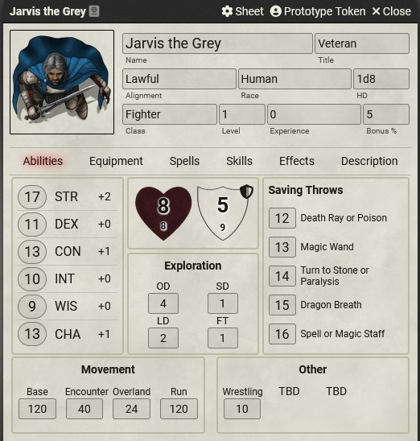
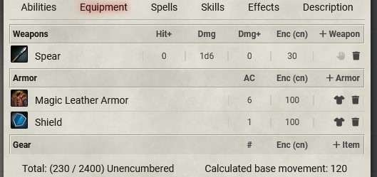
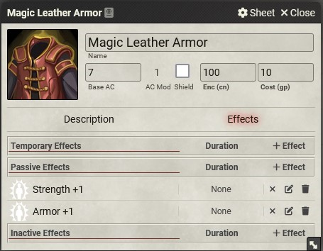

# Fantastic Depths - Foundry VTT System

This Foundry VTT system is inspired by Dark Dungeons, an OGL retro-clone of the Rules Cyclopedia edition of Dungeons & Dragons. Dark Dungeons was written by Blacky the Blackball, capturing the essence of classic D&D while modernizing and streamlining the rules for contemporary gameplay.

## Character Sheet

### Character Inventory

## Item Sheet
