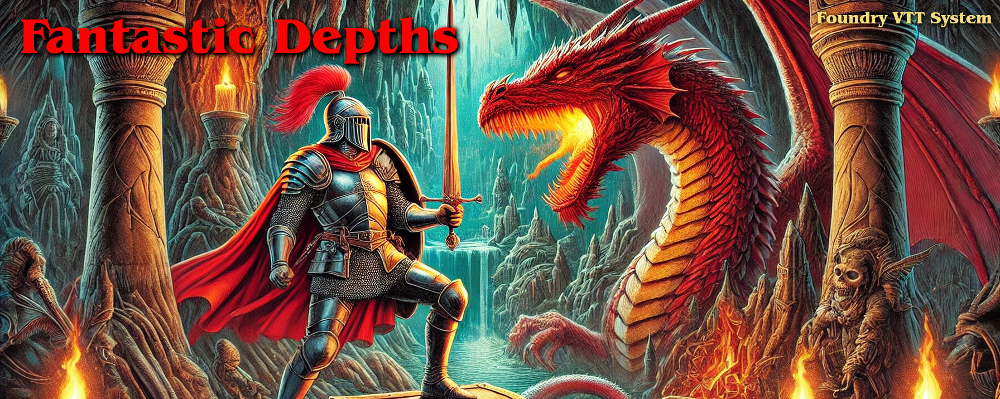
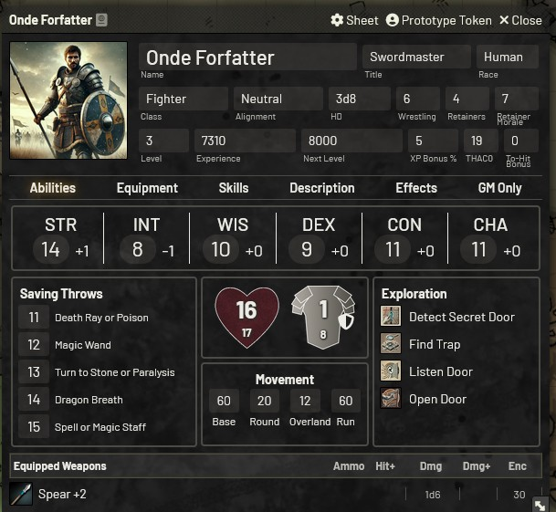
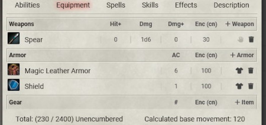
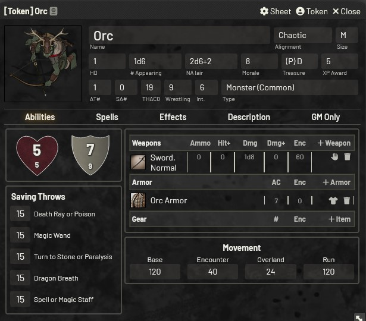
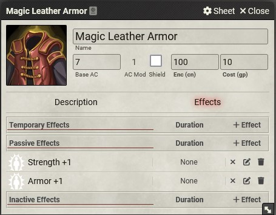

## Fantastic Depths - Foundry VTT v14 System

This [Foundry Virtual Tabletop](https://foundryvtt.com/packages/fantastic-depths) system is inspired by Dark Dungeons, an OGL retro-clone of the Rules Cyclopedia edition of Dungeons & Dragons. Dark Dungeons was written by Blacky the Blackball, capturing the essence of classic D&D while modernizing and streamlining the rules for contemporary gameplay.

The system comes with two themes, which are a light mode and a dark mode.

---

Fantastic Depths is on [Discord](https://discord.gg/6nCTfKun9d).

Compendiums are available as a [separate module](https://github.com/Forelius/fade-compendiums).

WIKI: https://github.com/Forelius/fantastic-depths/wiki

[Italian localization](https://github.com/fvtt-italian-translations/fade-lang-it) availble by FR4NC35C0, N1xx1 and Wingfireblade(Paolo).

If you wish to send me a financial gift, you can do so on Ko-Fi: https://ko-fi.com/forelius

Manual install (Stable): https://raw.githubusercontent.com/Forelius/fantastic-depths/refs/heads/stable/system.json

Manual install (Pre-Release): https://raw.githubusercontent.com/Forelius/fantastic-depths/refs/heads/main/system.json

**Thanks to the playtesters:** Hal²O, Darvus Maximus, borealforestbase, Francis Marcus Au Yeung, Jordan, FR4NC35C0, Wingfireblade(Paolo), Sobran, Dice-Goblin, Herrenlosigkeit, silentcatfart, Halindir, and many others.

---

# Compatible Modules
These are modules that were made as companion modules for Fantastic Depths or are integrations with other developer's modules.

There might be other modules out there that are missing. If you want your module listed then submit a PR with the module added to the list or contact me via the Discord server.

* [Combat Carousel for Fantastic Depths](https://github.com/FR4NC35CO/fantastic-depths-combat-carousel)
* [Damage Log](https://codeberg.org/cs96and/FoundryVTT-damage-log)
* [Fantastic Depths Compendiums Tokens](https://github.com/Forelius/fade-compendiums-tokens)
* [Fantastic Depths DM Screen](https://github.com/FR4NC35CO/fantastic-depths-dm-screen)
* [Item Piles](https://github.com/fantasycalendar/FoundryVTT-ItemPiles)
* [Token Action HUD](https://github.com/Larkinabout/fvtt-token-action-hud-core) via [Token Action HUD Fantastic Depths](https://github.com/Forelius/token-hud-fade)
* [White Box: FMAG for Fantastic Depths](https://github.com/Forelius/fade-white-box-fmag)

---

## Character Sheet
The character sheets are designed to be flexible and will provide class and level automation for any world-defined classes. Monsters and retainers are also supported. Core classes are recognized when entered into the class field or dragged and dropped from a class item. Setting the class will result in the auto-population of various class-related inputs. Most auto-populated class-related values can be overwritten if desired.

### Character Inventory

## Monster Sheet
The monster sheet allows for custom equippment, spells, special abilities and possession and use of most items.

## Item Sheet
There are item sheets for character classes, exploration abilities, saving throws, adventuring gear, armor, weapons, general skills, weapon masteries, spells and special class abilities.

### Effects
Effects can be added to all weapons, armor and adventuring gear. The effect can modify a value on the item or on the owning character.

