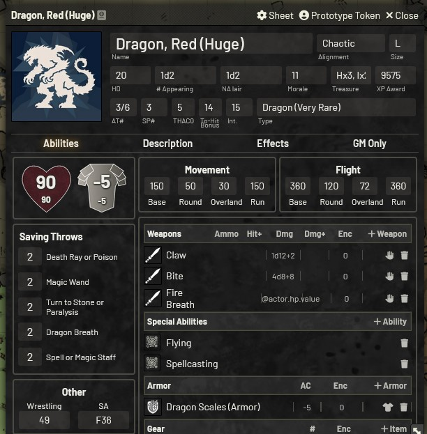
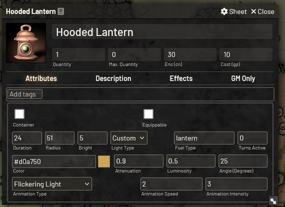
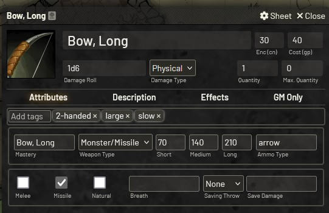
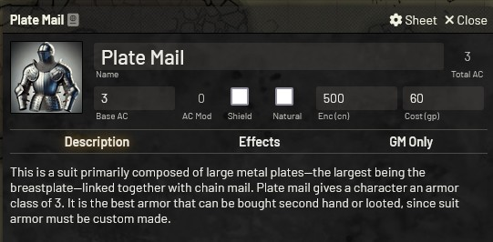
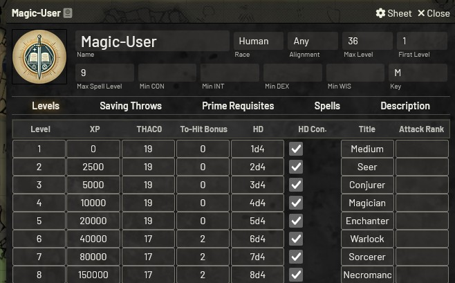

## Fantastic Depths - Foundry VTT System

This Foundry VTT system is inspired by Dark Dungeons, an OGL retro-clone of the Rules Cyclopedia edition of Dungeons & Dragons. Dark Dungeons was written by Blacky the Blackball, capturing the essence of classic D&D while modernizing and streamlining the rules for contemporary gameplay.

The system comes with two themes, which are a light mode and a dark mode.

---
Manual install (Stable): 
https://raw.githubusercontent.com/Forelius/fantastic-depths/refs/heads/stable/system.json

Manual install (Pre-Release): 
https://raw.githubusercontent.com/Forelius/fantastic-depths/refs/heads/main/system.json

---

We are on Discord: https://discord.gg/6nCTfKun9d

Compendiums are available as a separate module: https://github.com/Forelius/fade-compendiums

WIKI: https://github.com/Forelius/fantastic-depths/wiki

Italiano localization by FR4NC35C0, N1xx1 and Wingfireblade(Paolo).

**Thanks to the testers:** Hal²O, Darvus Maximus, borealforestbase, Francis Marcus Au Yeung, Jordan, 
FR4NC35C0 Wingfireblade(Paolo), Sobran, Dice-Golem and Herrenlosigkeit.

---

## Character Sheet
The character sheets are designed to be flexible and will provide class and level automation for any world-defined classes. Monsters and retainers are also supported. Core classes are recognized when entered into the class field or dragged and dropped from a class item. Setting the class will result in the auto-population of various class-related inputs. Most auto-populated class-related values can be overwritten if desired.

### Character Inventory

### Character Skills

## Monster Sheet
The monster sheet allows for custom equippment, spells, special abilities and possession and use of most items.

## Item Sheet
There are item sheets for character classes, exploration abilities, saving throws, adventuring gear, armor, weapons, general skills, weapon masteries, spells and special class abilities.

### Light Item Sheet

### Weapon Sheet

### Armor Sheet

### Class Sheet

### Skill Sheet

### Weapon Mastery Definition Sheet

### Actor Weapon Mastery Sheet

### Spell Sheet

### Effects
Effects can be added to all weapons, armor and adventuring gear. The effect can modify a value on the item or on the owning character.

