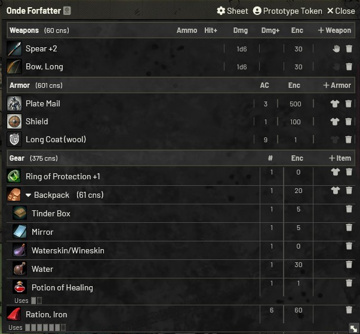
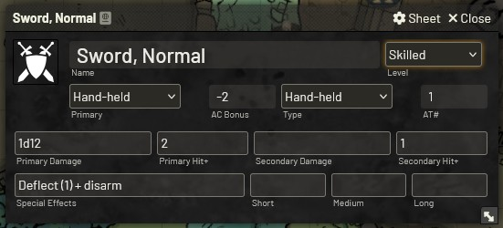
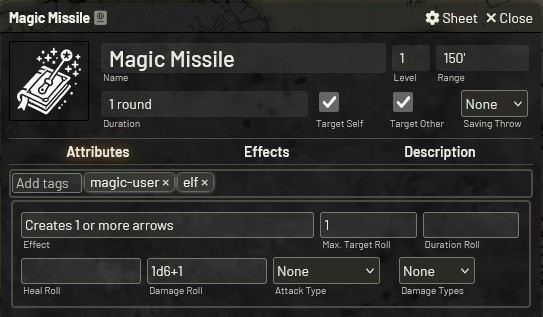

# Fantastic Depths - Foundry VTT System

This Foundry VTT system is inspired by Dark Dungeons, an OGL retro-clone of the Rules Cyclopedia edition of Dungeons & Dragons. Dark Dungeons was written by Blacky the Blackball, capturing the essence of classic D&D while modernizing and streamlining the rules for contemporary gameplay.

The system comes with two themes, which are a light mode and a dark mode.

- Manual install (Stable): https://raw.githubusercontent.com/Forelius/fantastic-depths/refs/heads/stable/system.json
- Manual install (Pre-Release): https://raw.githubusercontent.com/Forelius/fantastic-depths/refs/heads/main/system.json

We are on Discord: https://discord.gg/6nCTfKun9d

Compendiums are available as a separate module: https://github.com/Forelius/fade-compendiums

Italiano localization by FR4NC35C0, N1xx1 and Wingfireblade(Paolo).

**Thanks to the testers:** Hal²O, Darvus Maximus, borealforestbase, Francis, Jordan, FR4NC35C0 and Wingfireblade(Paolo).

---

## Character Sheet
The character sheet can handle any of the core classes and levels up to 24. Monsters and retainers are also supported. Core classes are recognized when entered into the class field, and this will result in the auto-population of various class-related inputs. All auto-populated class-related values can be overwritten if desired.

### Character Inventory

## Monster Sheet
The monster sheet allows for custom equippment, spells and possession and use of magic items.

## Item Sheet
There are item sheets for adventuring gear, armor, weapons, general skills, weapon masteries, spells and special class abilities.

### Weapon Sheet

### Armor Sheet

### Skill Sheet

### Weapon Mastery Sheet

### Spell Sheet

### Effects
Effects can be added to all weapons, armor and adventuring gear. The effect can modify a value on the item or on the owning character.
